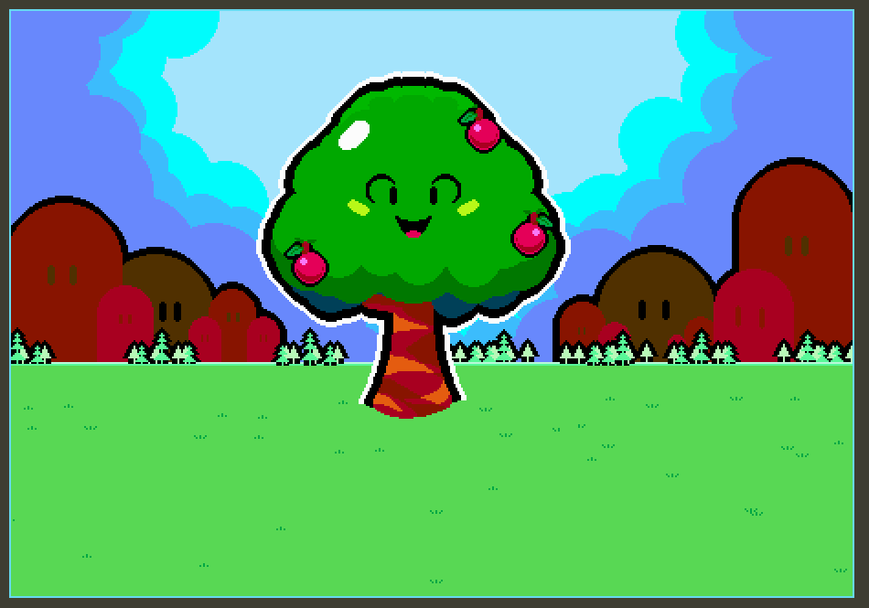

# ARBO
ARBO a game in which you get back digitally for nurturing the environment. All profits will be used to buy toucan carbon credits

  

## Folder structure
1. hardhat -> Smart contract code
2. ARBO -> The Gamemaker game
3. assets -> Images for the repo 
4. middleware -> Public/Permisonless backend code that allows for maintaining cache information for speedy game processing 

## How the game works 

## Design Philosophy
We needed a backend server that can serve information quickly to the game inorder to make the game fun to play.
The data is written to the smart contracts and if ever data is needed to be written into the backend it will be verified first.
All final states will be maintained on chain. 

/// TODO: How to stop the flow on a condition