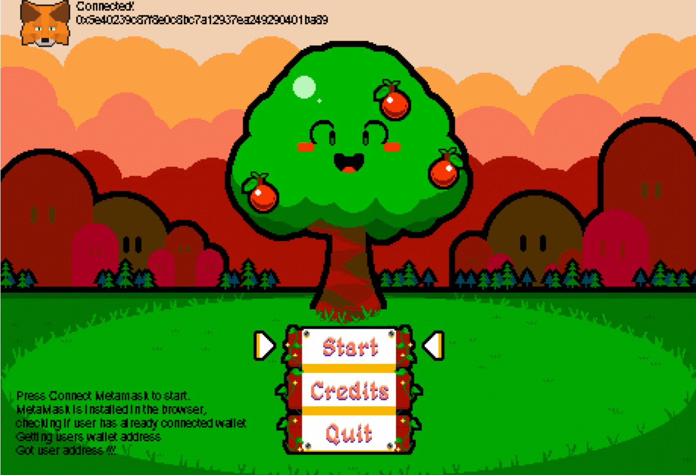
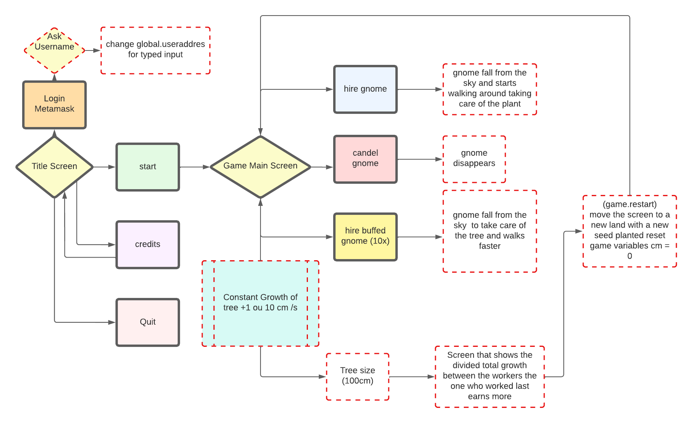

# ARBO
ARBO a game in which you get back digitally for nurturing the environment. All profits will be used to buy toucan carbon credits

  

## Design of the game

  

## Folder structure
1. hardhat -> Smart contract code
2. ARBO -> The Gamemaker game
3. assets -> Images for the repo 
4. middleware -> Public/Permisonless backend code that allows for maintaining cache information for speedy game processing 

## How the game works 
A tree(NFT token) is planted by the NFT contract [seed time, growth in cm(0), max growth(random, capped)]
A user creates/updates the flow, based on the growth input from oracle [time, growth in cm = multiplier X flowrate(capped)]
  - calculate if win happened, by comparing last growth with max growth
  - close the flows from all users
As a winner I can redeem the NFT and claim outflow by paying a fee. The fee goes 5% to protocol, 95% to other players.

## Development Phases
Phase 1 -> Keep all code via web3 calls
Phase 2 -> Deploy on optimism and polygon
Phase 3 -> Change to ACL superfluid to improve game UX

## Reference Libraries used
1. We used https://github.com/relaycc/relay for the xmtp chat client
2. We used graph-client/javascript-cjs for the graph-relayer module

## Issues

/// TODO: How to stop the flow on a condition